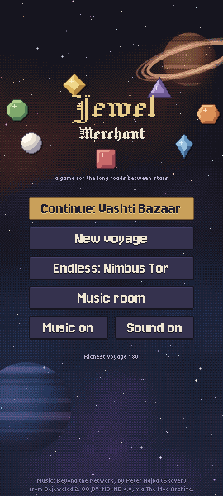
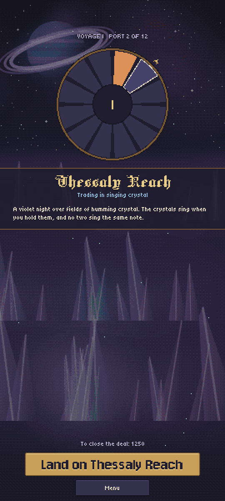
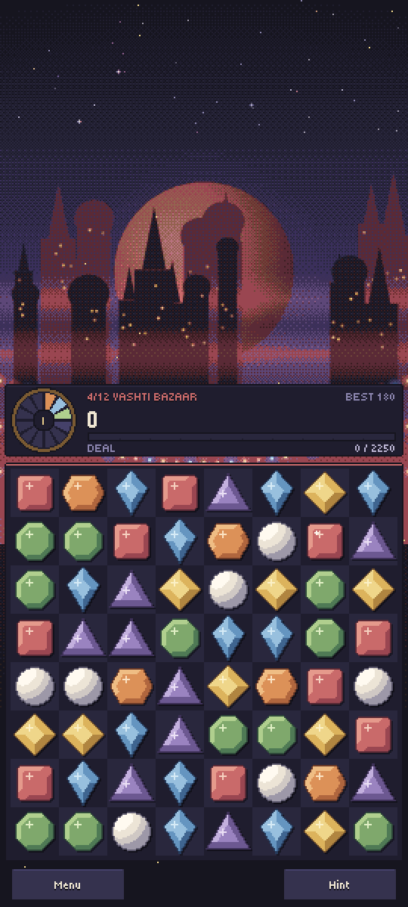
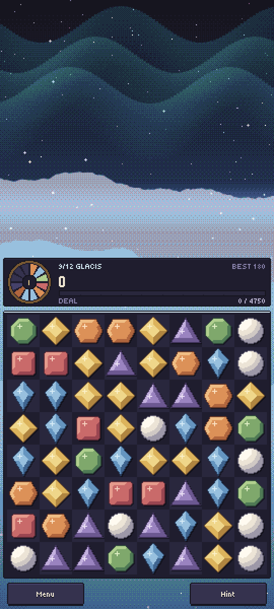
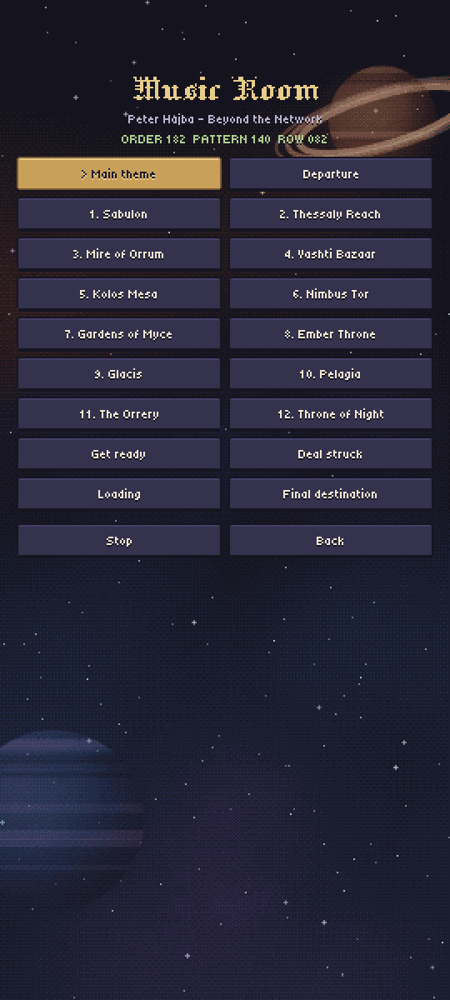

# Jewel Merchant

*A game for the long roads between stars.* A pixel-art match-3 game for Android. You fly a
trading ship to twelve planets, and on each one you close a deal by matching gems. The music
is *Beyond the Network* from Bejeweled 2, played live through libopenmpt.

<p align="center">
  
  
  
</p>
<p align="center">
  
  
</p>

## Modes

- **Voyage**: visit the twelve ports in order. Each one sets a score you must reach to close
  the deal. If no moves are left, the game ends.
- **Endless**: you cannot lose. A board with no moves gets reshuffled, and the planets repeat.
- **Music room**: play any track from the soundtrack.

## Building

`build.sh` builds `Jewels.apk` without Gradle. It needs an Android SDK (build-tools 35,
platform 35, an NDK and a JDK) in `~/android-sdk`; set `ANDROID_SDK` or `ANDROID_NDK` to use
another location.

```sh
git clone --recursive <repo>
./build.sh
adb install -r Jewels.apk
```

## Credits

See [CREDITS.md](CREDITS.md). The music is CC BY-NC-ND 4.0, so this project must stay
non-commercial.
